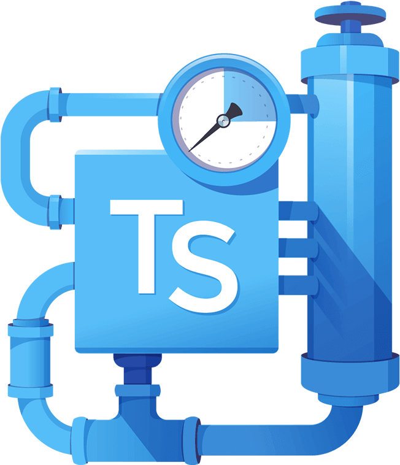

# typescript-template

<!-- 


 -->

Generic description

## Usage

```
npm install ???
```

### Example Usage

Find full example [here](https://github.com/thomaschaplin/) but see the below code snippet

```ts
import {add} from "typescript-template"

const answer = add(1, 2)
console.log(answer)
```

## Description

This repository allows you to...

This project uses:

- [something](https://github.com/thomaschaplin)

## Setup

Make sure you have [Node.js](https://nodejs.org/en/) installed on your machine

### Development

#### Installation

- Clone this repository
  `git clone git@github.com:thomaschaplin/???.git`
- Change directory `cd ???`
- Install the dependencies `npm install`
- Transpile the code `npm run build` or `npm run watch`

#### Tests

- Run the tests `npm test`
- Run the tests with coverage `npm run test:coverage`
- Run the tests with mutation testing `npm run test:mutation`

---

[Logo](https://www.clipartkey.com/view/ximJRi_typescript-advantages/) graphic by <a href="https://www.clipartkey.com/upic/1981/">David</a> from ClipArtKey.
